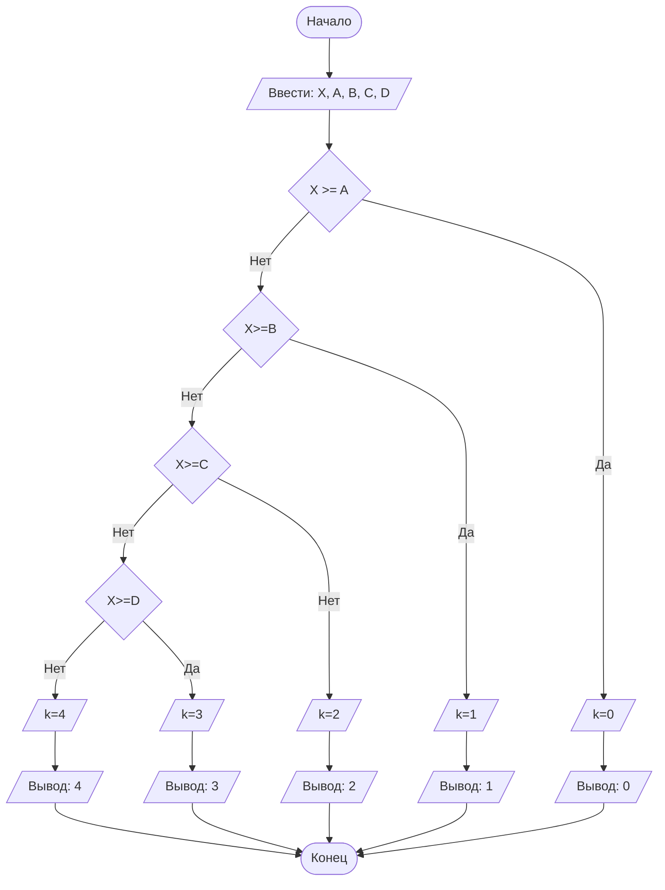

# Lab1
## Отчет по лабораторной работе № 1

#### № группы: `ПМ-2502`

#### Выполнил: `Гвоздева Ирина Владимировна`

#### Вариант: `3`

### Cодержание:

- [Постановка задачи](#1-постановка-задачи)
- [Входные и выходные данные](#2-входные-и-выходные-данные)
- [Выбор структуры данных](#3-выбор-структуры-данных)
- [Алгоритм](#4-алгоритм)
- [Программа](#5-программа)
- [Анализ правильности решения](#6-анализ-правильности-решения)

### 1. Постановка задачи

> Шарик диаметром X пытаются протащить через последовательность отверстий диаметрами  A, B, C, D. Через какое количество отверстий удастся протащить шарик? На вход программы подаются натуральные числа X, A, B, C, D.

В данной задаче нужно рассмотреть 5 случаев.

1. Шарик не проходит через первое отверстие (X>=A).
2. Шарик проходит через первое отверстие, но не проходит через второе (X<A и X>=B).
3. Шарик проходит через первое и второе отверстия, но не проходит через третье (X<A,B, X>=С).
4. Шарик проходит через первое, второе и третье отверстия, но не проходит через четвертое (X<A,B,C, X>=D).
5. Шарик проходит через все отверстия (X<A,B,C,D).

### 2. Входные и выходные данные

#### Данные на вход

На вход программа должна получать 5 натуральных чисел.

|                                  | Тип         | 
|----------------------------------|-------------|
| X (диаметр шарика)               | Целое число |           
| A (диаметр первого отверстия)    | Целое число | 
| B (диаметр второго отверстия)    | Целое число | 
| C (диаметр третьего отверстия)   | Целое число | 
| D (диаметр четвертого отверстия) | Целое число | 
#### Данные на выход

Программа должна вывести количество отверстий, через которые сможет пройти шарик. Это целое неотрицательное число от 0 до 4. 

|         | Тип                         |
|---------|-----------------------------|
| k       | Целое неотрицательное число |

### 3. Выбор структуры данных

Программа получает 5 целых чисел, обозначающих размеры шарика и отверстий. Для их хранения
можно выделить 5 переменных (`X`, `A`, `B`, `C`, `D`) типа `int`. Для вывода результата необходимо создать отдельную переменную `k` типа `int`.

|                                     | название переменной | Тип (в Java) | 
|-------------------------------------|---------------------|--------------|
| X (диаметр шарика)                  | `X`                 | `int`        |
| A (диаметр первого отверстия)       | `A`                 | `int`        | 
| B (диаметр второго отверстия)       | `B`                 | `int`        |   
| C (диаметр третьего отверстия)      | `C`                 | `int`        | 
| D (диаметр четвертого отверстия)    | `D`                 | `int`        | 
| k (количество пройденных отверстий) | `k`                 | `int`        | 


### 4. Алгоритм

#### Алгоритм выполнения программы:

1. **Ввод данных:**  
   Программа считывает 4 целых числа, обозначенные как `X`, `A`, `B`, `C`, `D`.
   Переменной `k` присваивается значение 0.

3. **Сравнение чисел:**  
   Программа сравнивает значения `X` и `A`. Если `X` больше или равно `A`, программа выводит ответ. В противном случае переменная k увеличивается на 1, и программа продолжает работу.
   Аналогично `X` сравнивается с `B`, `C` и `D`. 
   

5. **Вывод результата:**  
   На экран выводится количество отверстий, через которые смог пройти шарик.

#### Блок-схема



### 5. Программа

```java
import java.io.PrintStream;
import java.util.Scanner;

public class Main {
    // Объявляем объект класса Scanner для ввода данных
    public static Scanner in = new Scanner(System.in);
    // Объявляем объект класса PrintStream для вывода данных
    public static PrintStream out = System.out;

    public static void main(String[] args) {
        // Считывание двух вещественных чисел x и y из консоли
        double x = in.nextDouble();
        double y = in.nextDouble();

        // Определение максимального числа
        if (x >= y) {
            // Если x положительное, выводим x, иначе выводим -x,
            // чтобы на выходе было его абсолютное значение
            if (x >= 0) {
                out.println(x);
            } else {
                out.println(-x);
            }
        } else {
            // Если x положительное, выводим y, иначе выводим -y,
            // чтобы на выходе было его абсолютное значение
            if (y >= 0) {
                out.println(y);
            } else {
                out.println(-y);
            }
        }
    }
}
```

### 6. Анализ правильности решения

Программа работает корректно на всем множестве решений с учетом ограничений.

1. Тест на `X > Y > 0`:

    - **Input**:
        ```
        5 1.3
        ```

    - **Output**:
        ```
        5
        ```

2. Тест на `X < Y < 0`:

    - **Input**:
        ```
        -4 -2.2
        ```

    - **Output**:
        ```
        2.2
        ```

3. Тест на `X < 0 < Y`:

    - **Input**:
        ```
        -4 5
        ```

    - **Output**:
        ```
        5
        ```

4. Тест на `X = 0` или `Y = 0`:

    - **Input**:
        ```
        0 -3
        ```

    - **Output**:
        ```
        3
        ```

5. Тест на ограничение задачи:

    - **Input**:
        ```
        -1000000000 1000000000
        ```

    - **Output**:
        ```
        1000000000
        ```
